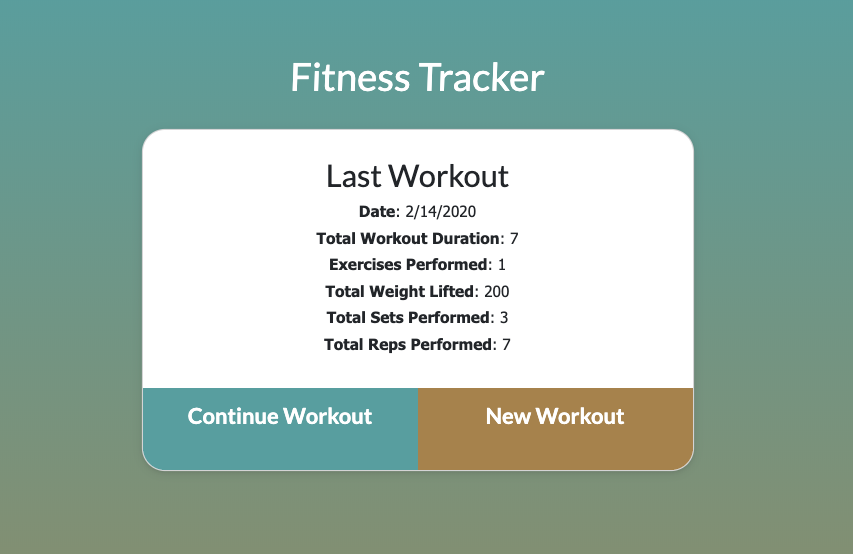
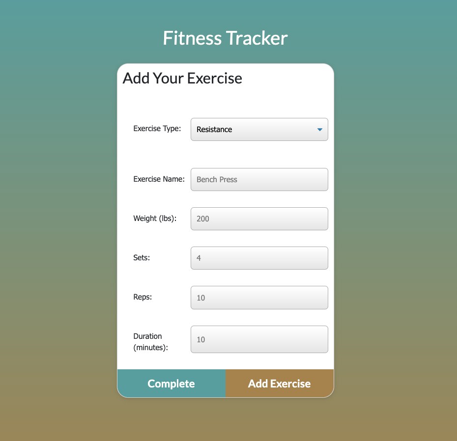
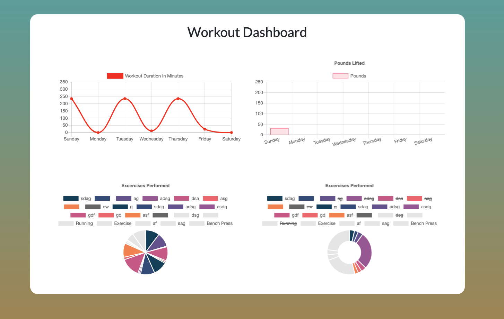

# Fitness-Tracker

Deployable Link:

https://young-ridge-72322.herokuapp.com/?id=5e46ab0462904600179ca213

## About The Project

I created a way to track your fitness goals and performance all in one place.

You can:

- Create a Workout
- Add as many exercises to the workout you want
- End a workout
- See your workout data on a chart

### Features

The ability to search through the database add and edit

- To add and update employee data
- Add new departments
- Add new roles

### Built With

- Mongodb
- Mongoose.js
- Node.js
- Bootstrap
- Express

<!-- GETTING STARTED -->

## Getting Started

### Creating Workout

- Start by clicking new workout

### Add Exercise

- You will be given an option to choose
  - Resitance
  - Cardio
- Then different optiosn will show up based on your choice
- When you are done filling in your exercises click "Add Exercise"

### See Workout Data

- Click on Dashboard in the top left corner to view all of your previous workouts and your performance

